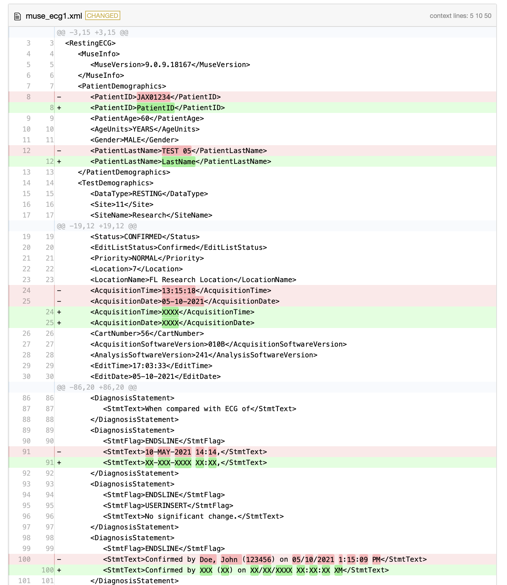

<!-- README.md is generated from README.Rmd. Please edit that file -->

```{r, include = FALSE}
knitr::opts_chunk$set(
  collapse = TRUE,
  comment = "#>",
  fig.path = "man/figures/README-",
  out.width = "100%"
)
```

# musePHI


<!-- badges: start -->
[](https://github.com/overdodactyl/musePHI/actions/workflows/R-CMD-check.yaml)
<!-- badges: end -->

`musePHI` is a package designed to assist in the de-identification of MUSE ECG XML files. It enables users to replace sensitive patient information within XML files with placeholders, maintaining the overall structure of the files. This approach helps in ensuring patient privacy while allowing the data to be used for research or analysis purposes.

## Disclaimer

It is the responsibility of the user to accurately identify and replace values that need to be de-identified from the XML file. Furthermore, users must validate the results to ensure no personal health information (PHI) is inadvertently disclosed. The developers of `musePHI` assume no liability for the misuse of this software or the inadvertent sharing of PHI.


## Installation

You can install the development version of musePHI from [GitHub](https://github.com/) with:

``` r
# install.packages("devtools")
devtools::install_github("overdodactyl/musePHI")
```

## Example

```{r example}
library(musePHI)
```

The function takes an input XML file, an output file path, and a list of replacement patterns. Each replacement pattern is applied to the text content of specified XML nodes.

The example below shows how regular expressions can be used to replace entire nodes are patterns within nodes. 

In order to capture dates and date times within the diagnoses sections, we will construct some regular expressions:

```{r}
# Create a string of valid month abbreviations
months <- paste(toupper(month.abb), collapse = "|")

# Define regex replacements with specific month abbreviations
dx_replace <- setNames(
  list(
    # Replacement for date-time format
    "XX-XXX-XXXX XX:XX",  
    # Replacement for date format
    "XX-XXX-XXXX",     
    # Replacement for confirmation format
    "Confirmed by XXX (XX) on XX/XX/XXXX XX:XX:XX XM" 
  ),
  c(
    paste0("\\d{2}-(", months, ")-\\d{4} \\d{2}:\\d{2}"),
    paste0("\\d{2}-(", months, ")-\\d{4}"),
    "Confirmed by [A-Za-z]+, [A-Za-z]+ \\(\\d+\\) on \\d{1,2}/\\d{1,2}/\\d{4} \\d{1,2}:\\d{2}:\\d{2} [APM]+"
  )
)
```

Below, we construct a full list of replacements. `".*"` is used to replace an entire node. 

```{r}
replace <- list(
  "/RestingECG/PatientDemographics/PatientLastName" = list(".*" = "LastName"),
  "/RestingECG/PatientDemographics/PatientFirstName" = list(".*" = "FirstName"),
  "/RestingECG/PatientDemographics/PatientID" = list(".*" = "PatientID"),
  "/RestingECG/PatientDemographics/DateofBirth" = list(".*" = "XXXX"),
  "/RestingECG/TestDemographics/AcquisitionTime" = list(".*" = "XXXX"),
  "/RestingECG/TestDemographics/AcquisitionDate" = list(".*" = "XXXX"),
  "/RestingECG/Diagnosis/DiagnosisStatement/StmtText" = dx_replace,
  "/RestingECG/OriginalDiagnosis/DiagnosisStatement/StmtText" = dx_replace
)
```

Specify the path to your existing XML file and the path for the new de-identified XML file. Then, call `muse_deidentify`:

```{r}
file <- muse_example("muse/muse_ecg1.xml")
output_file <- tempfile(fileext = ".xml")
muse_deidentify(file, output_file, replace)
```

We recommend use a file diff viewer to visually inspect some replacements to make sure only the intended changes are being made. 

This could be done with the `diffviewer` R package:

```{r eval=FALSE}
diffviewer::visual_diff(file, output_file)
```

```{r echo=FALSE}

```

It could also be done via the `diff` linux tool:

```{r}
cmd <- paste("diff -u", file, output_file)
res <- system(cmd, intern = TRUE)
cat(res, sep = "\n")
```


**NOTE:** It is recommended to save the de-identified ECG data to a new file to preserve the original data.

## Parallelization 

For users working with a large number of XML files, parallelization can significantly speed up the de-identification process. We recommend using the [furrr](https://furrr.futureverse.org) package to efficiently parallelize your workload.

To demonstrate this, we will process 10000 XML files sequentially and in parallel using 10 CPUs. 

First, create 10000 XML files in a temporary directory:

```{r}

dir <- fs::path_temp("xmls")
fs::dir_create(dir)

for (i in 1:100) {
  fs::file_copy(
    "inst/extdata/muse/muse_ecg1.xml",
    fs::file_temp(tmp_dir = dir, ext = ".xml")
  )
}

```

Next, create a list of XML files and create their new file paths:

```{r}
xml_files <- fs::dir_ls(dir)
deidentified_dir <- fs::path_temp("deidentified_xmls")
fs::dir_create(deidentified_dir)
deidentified_xmls <- fs::path(deidentified_dir, fs::path_file(xml_files))
```

```{r}
library(tictoc)
```


Run `muse_deidentify` sequentially:

```{r}
tic()
for (i in seq_along(xml_files)) {
  muse_deidentify(xml_files[i], deidentified_xmls[i], replace)
}
toc()
```

Run in parallel:

```{r}
library(furrr)
plan(multisession, workers = 10)
```

```{r}
tic()
future_walk2(xml_files, deidentified_xmls, muse_deidentify, replace = replace)
toc()
```

# Summarizing Diagnosis Data

```{r}
diagnoses <- future_map_dfr(deidentified_xmls, muse_diagnoses)

diagnoses |> 
  dplyr::count(value, sort = TRUE)
```


